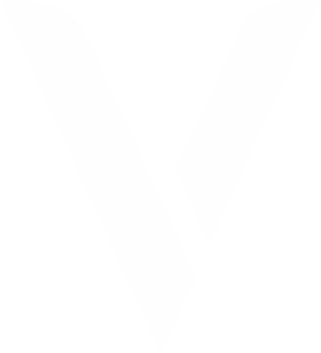
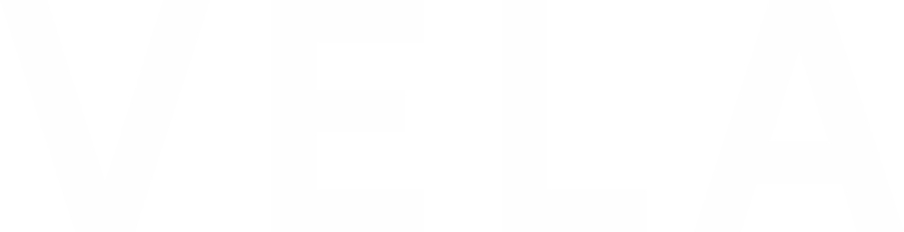

<html lang="es">
<head>
  <meta charset="UTF-8">
  <meta name="viewport" content="width=device-width, initial-scale=1.0">
  <title>VELA | Tienda de Calzado</title>
  <link rel="icon" href="img/vela-icon2.png" type="image/png">
  
  
</head>
<body>

  <!-- Encabezado con logo principal -->
  <header>
    
    <nav>
      <a href="#">Inicio</a>
      <a href="#productos">Productos</a>
      <a href="#contacto">Contacto</a>
    </nav>
  </header>

  <!-- Sección principal (Hero) con icono V -->
  <section class="hero">
    

      
      <h2>Calzado que define tu estilo</h2>
      
Encuentra los mejores modelos de la marca VELA

      <a href="#productos" class="btn">Ver colección</a>
    

  </section>

  <!-- Productos -->
  <section id="productos" class="productos">
    <h2>Nuestros Productos</h2>
    

      <!-- Producto 1 -->
      

        
        <h3>Tenis Urban</h3>
        
Comodidad y estilo para tu día a día.

        
$299 MXN

        <a href="#" class="btn" onclick="return comprar('Tenis Urban');">Comprar</a>
      

      <!-- Producto 2 -->
      

        
        <h3>Botines Elegance</h3>
        
Perfectos para ocasiones especiales.

        
$899 MXN

        <a href="#" class="btn" onclick="return comprar('Botines Elegance');">Comprar</a>
      

      <!-- Producto 3 -->
      

        
        <h3>Sandalias Breeze</h3>
        
Frescura y ligereza para el verano.

        
$999 MXN

        <a href="#" class="btn" onclick="return comprar('Sandalias Breeze');">Comprar</a>
      

    

  </section>

  <!-- Footer con logo VÉLA texto y redes sociales -->
  <footer id="contacto">
    
    

      <!-- WhatsApp -->
      <a href="https://wa.me/524775809107" target="_blank" title="WhatsApp">
        <svg class="icon" viewBox="0 0 32 32" fill="none">
          <circle cx="16" cy="16" r="16" fill="#25D366"/>
          <path d="M22.2 18.4c-.3-.2-1.6-.8-1.8-.9-.2-.1-.4-.2-.6.2-.2.4-.7.9-.9 1.1-.2.2-.4.2-.7.1-.3-.1-1.3-.5-2.5-1.4-.9-.8-1.5-1.7-1.7-1.9-.2-.2-.1-.4.1-.5.2-.2.4-.5.6-.8.2-.2.2-.4 0-.6-.1-.2-.6-1.4-.8-1.9-.2-.5-.4-.4-.6-.4-.2 0-.4 0-.6 0-.2.1-.5.2-.7.5-.2.3-.7.8-.7 2 0 1.2.8 2.3 1 2.5.2.2 2 3.2 4.9 4.4 2.9 1.2 3.2.8 3.8.7.5-.1 1.6-1.1 1.9-2.1.2-1-.1-1.2-.3-1.3z" fill="#fff"/>
        </svg>
        WhatsApp
      </a>
      <!-- Instagram -->
      <a href="https://instagram.com/" target="_blank" title="Instagram">
        <svg class="icon" viewBox="0 0 32 32" fill="none">
          <circle cx="16" cy="16" r="16" fill="#E1306C"/>
          <rect x="10" y="10" width="12" height="12" rx="4" fill="#fff"/>
          <circle cx="16" cy="16" r="3" fill="#E1306C"/>
          <circle cx="22" cy="12" r="1.2" fill="#E1306C"/>
        </svg>
        CALZADO VELA
      </a>
    

    
© 2025 VELA - Todos los derechos reservados.

    
📧 Contacto: <a class="email" href="mailto:velacalzado@gmail.com">velacalzado@gmail.com</a>

    
📍 Ubicación: San Francisco del Rincon, Gto, MX

  </footer>
